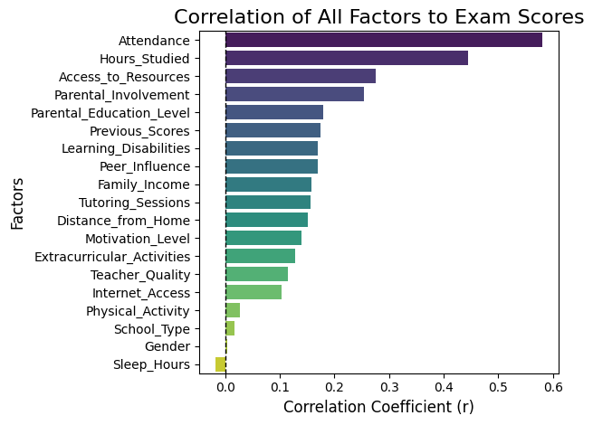

This project analyzes a dataset of student performance factors to determine which variables—both numerical and categorical—have the most significant impact on final exam scores. Using Pearson Correlation and Gap Analysis, this study provides real insights into which factors truly make an impact on students' performance at school.

Final results:

